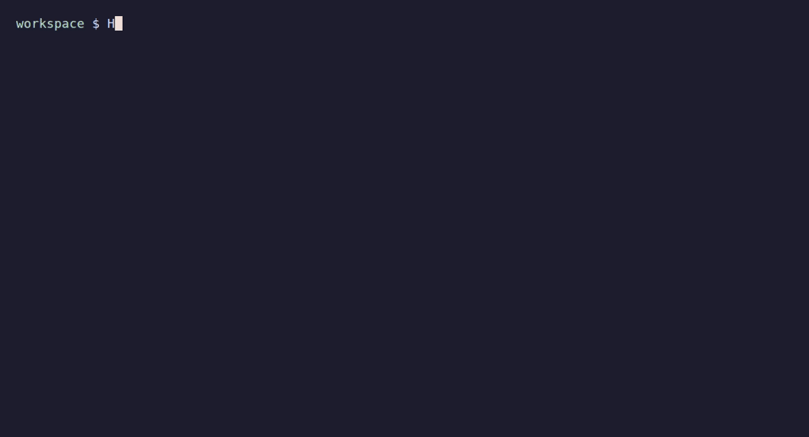

# go-to-kindle

📚 An interactive CLI that fetches web articles, turns them into readable self-contained HTML, archives them locally, and sends them to a Kindle.



## Start Here

- [Usage](docs/usage.md) — installation, email setup, controls, and troubleshooting.
- [Architecture](docs/architecture.md) — end-to-end flow, invariants, and module boundaries.
- [Development](docs/development.md) — project layout and contributor workflow.
- [Testing](docs/testing.md) — test boundaries and commands.
- [Documentation guide](docs/README.md) — documentation map and writing conventions.

Before changing the project, read the architecture overview and the relevant module document from the documentation guide. Keep tests beside the code they cover, update affected documentation when behavior changes, and treat the code as the source of truth.

## Highlights

- Imports web URLs, local HTML or Markdown, Safari webarchives, and clipboard Markdown.
- Extracts readable content, optionally embeds resized images, and supports English and Chinese word counting.
- Offers direct HTTP and opt-in headless-browser retrieval.
- Lets you review the title and date context before SMTP delivery.
- Keeps the generated Kindle-ready HTML in a local archive.

## Quick Start

Requires Go 1.26 or newer, an SMTP-enabled email account, and a Kindle address configured for email delivery.

```bash
go install github.com/yfzhou0904/go-to-kindle@latest
go-to-kindle
```

The first run creates `~/.go-to-kindle/config.toml` and opens it for setup. See the [usage guide](docs/usage.md) for source builds, configuration, and Kindle setup.
